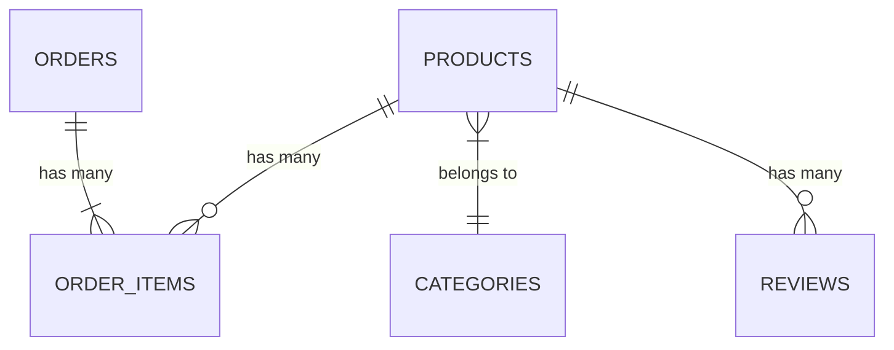

# Database Schema

## Supabase Tables

### 1. Products

```sql
create table products (
  id uuid primary key,
  name varchar,
  slug varchar unique,
  description text,
  price numeric,
  category_id uuid references categories(id),
  inventory int4,
  images text[],
  featured bool,
  created_at timestamptz default now()
);
```

### 2. Categories

```sql
create table categories (
  id uuid primary key,
  name varchar,
  slug varchar unique,
  description text,
  created_at timestamptz default now()
);
```

### 3. Orders

```sql
create table orders (
  id uuid primary key,
  customer_email varchar,
  customer_name varchar,
  shipping_address jsonb,
  billing_address jsonb,
  total numeric,
  status varchar,
  payment_id text,
  created_at timestamptz default now()
);
```

### 4. Order Items

```sql
create table order_items (
  id uuid primary key,
  order_id uuid references orders(id),
  product_id uuid references products(id),
  quantity int4,
  price numeric,
  created_at timestamptz default now()
);
```

### 5. Reviews

```sql
create table reviews (
  id uuid primary key,
  product_id uuid references products(id),
  customer_name varchar,
  rating int2,
  comment text,
  created_at timestamptz default now()
);
```

## Table Relationships



## Key Features

- UUID primary keys for all tables
- Timestamptz for all datetime fields
- JSONB for address storage in orders table
- Proper foreign key relationships
- Unique constraints on slugs
- Text array for product images
- Review system for products
